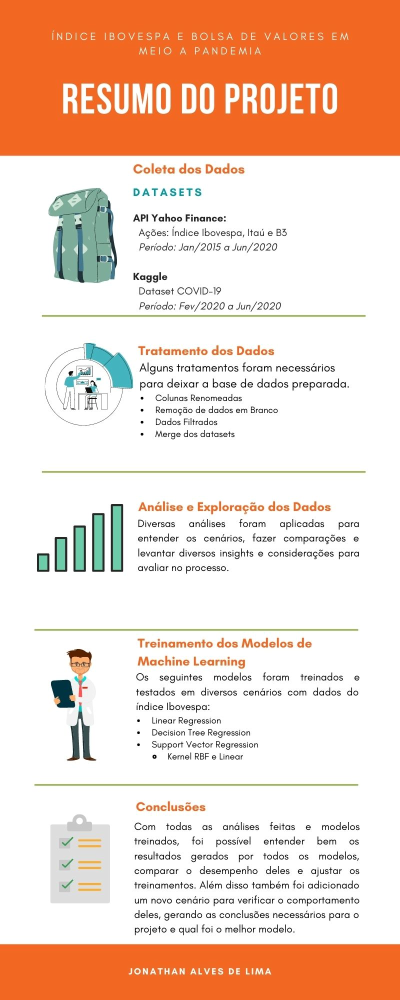

### **PONTIFÍCIA UNIVERSIDADE CATÓLICA DE MINAS GERAIS**

##### Trabalho de Conclusão de Curso

##### Ciência de Dados e Big Data

###### **Um estudo sobre o Índice IBOVESPA e bolsa de valores em meio a Pandemia de Coronavírus**

- [Link para o vídeo no Youtube](https://www.youtube.com/watch?v=sZcM5psCSo8&feature=youtu.be)

- 
<a href="./tcc-pucminas/Trabalho de Conclusão - Jonathan Alves de Lima.pdf">Link para o TCC em PDF</a>

| Pasta        | Conteúdo                                                          |
| :----------- | ----------------------------------------------------------------- |
| src          | Arquivos .py e .iypnb com todas as análises e execução do projeto |
| tcc-pucminas | TCC em PDF, Infográfico e Dataset (COVID-19)                      |

